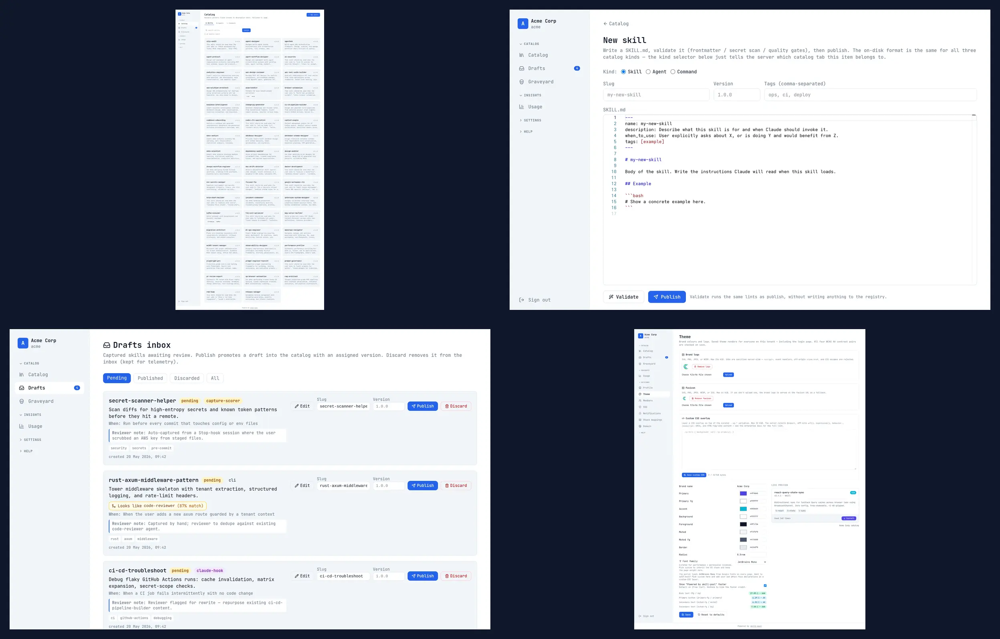
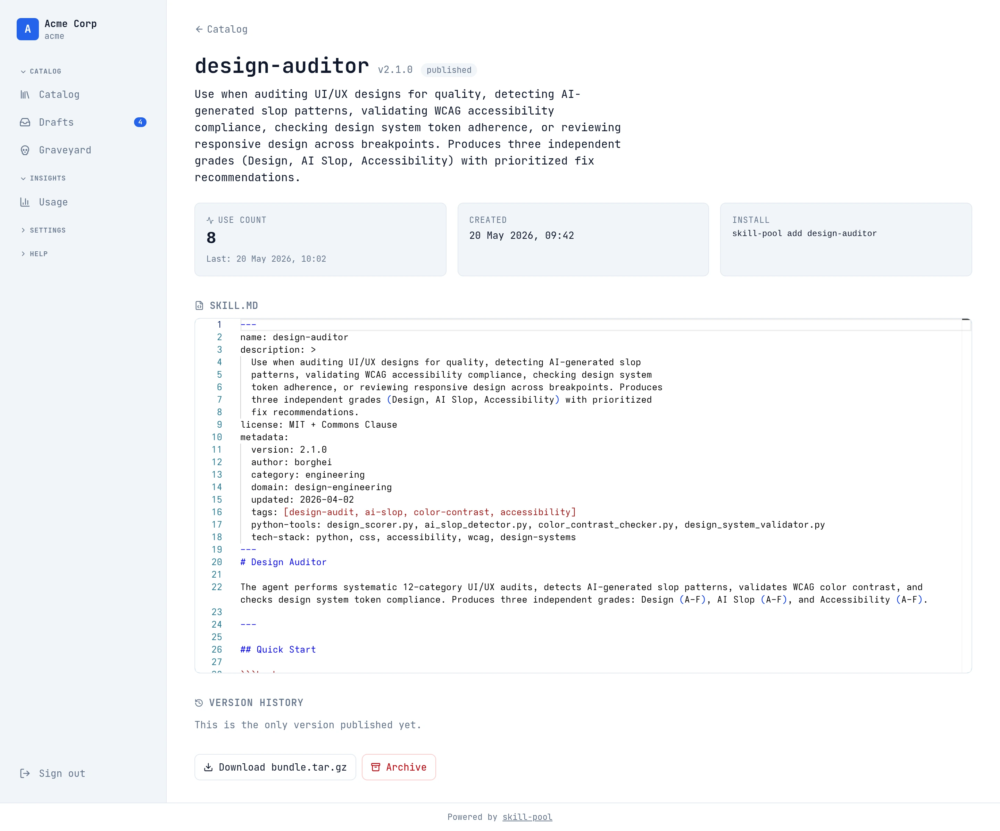
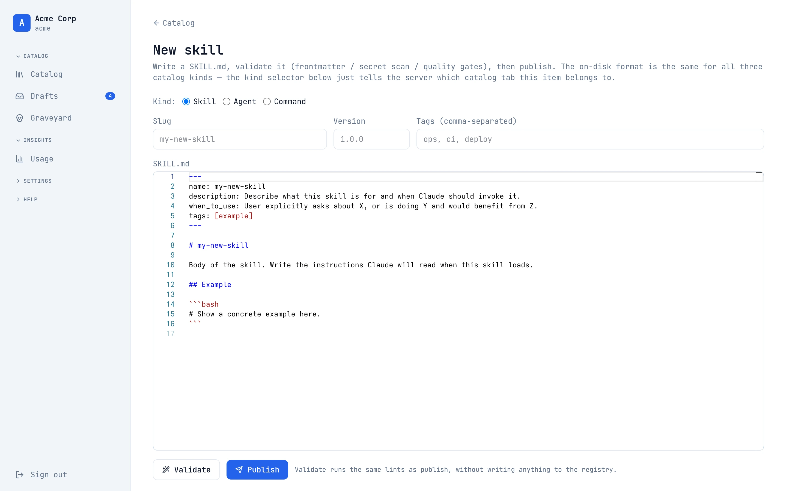
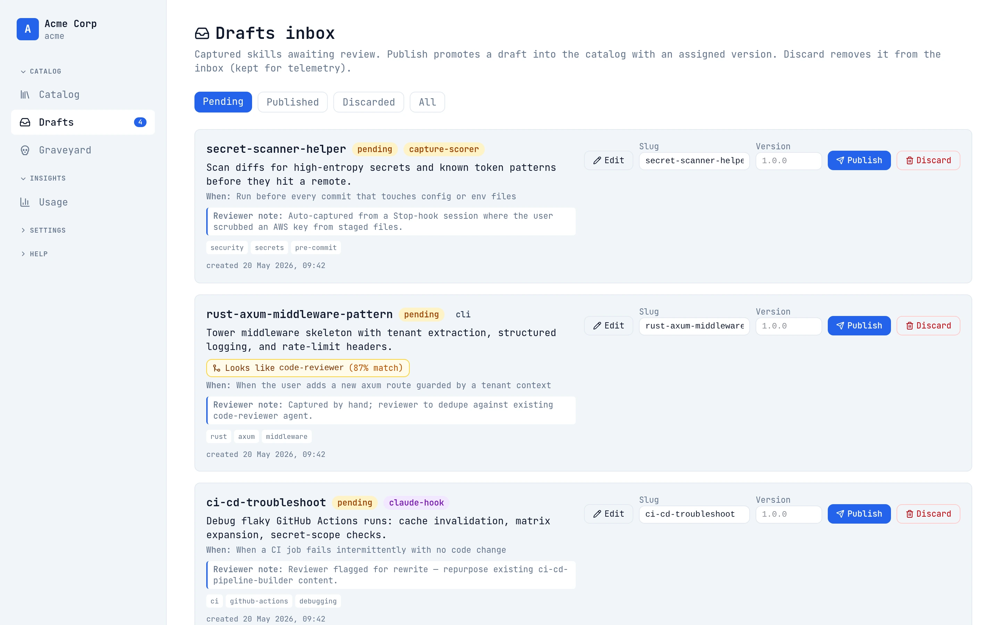
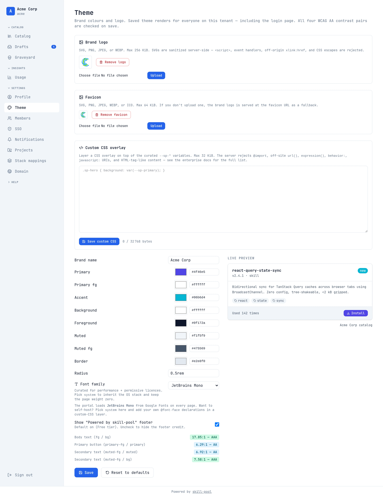
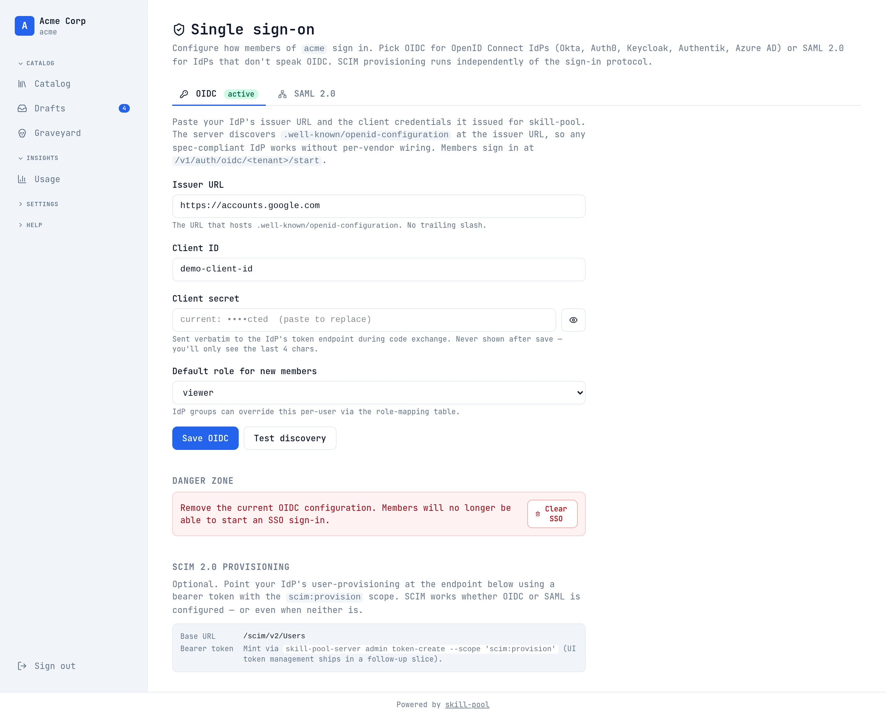
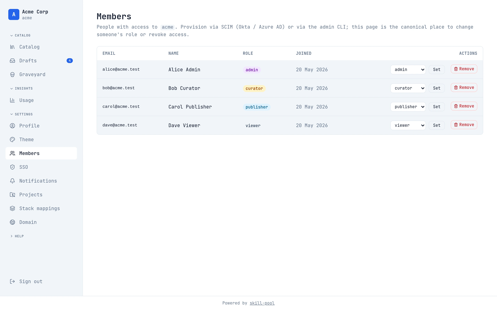
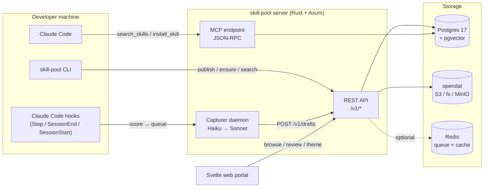

# skill-pool

> Self-hosted Claude Code skill registry for teams.

[](https://github.com/olafkfreund/skill_pool/actions/workflows/ci.yml)
[](#license)
[](https://www.rust-lang.org/)
[](https://kit.svelte.dev/)
[](https://www.postgresql.org/)
[](https://docs.claude.com/en/docs/claude-code)



## What is this?

Anthropic published `SKILL.md` as the open standard for Claude Code's extensibility surface — skills, subagents, slash commands. The single-developer story is solved: drop a file under `~/.claude/skills/`, and Claude picks it up. The **team story** isn't: every engineer hand-rolls their own `.claude/`, copy-pastes from awesome-lists, and the working knowledge of which prompt actually solves which problem stays trapped in one laptop.

**skill-pool is the team layer for `.claude/`.** It's a self-hosted, multi-tenant registry with a Rust API server, a Svelte web portal, and a CLI that knows how to install the right things for the project you just `cd`'d into. It runs on a Pi, on a NixOS box, on a Helm chart, or on AWS with the bundled Terraform. Skills publish through the CLI, install through the CLI, browse and review through the web portal — all behind tenant-scoped SSO with an audit trail.

The trick: **retrospective capture**. When Claude finishes a non-trivial fix in your editor, a Stop-hook scorer flags the session, a SessionEnd-hook queues it, and a Haiku→Sonnet daemon turns the transcript into a draft `SKILL.md` for human review. The team's `.claude/` grows from the work the team actually did, not from somebody's bookmark folder.

## Demo

<video src="docs/demo.webm" controls width="800" loop muted playsinline>
  Your browser does not render WebM inline. See the GIF fallback below.
</video>


A 48-second walkthrough: login → catalog → skill detail with version history → editor → drafts inbox → theme settings.

## Screenshots

| Skill detail | Editor | Drafts inbox |
| :---: | :---: | :---: |
|  |  |  |
| Per-tenant theme | OIDC SSO | Members & roles |
|  |  |  |

The full 76-skill catalog grid is also available: [`docs/images/catalog.webp`](docs/images/catalog.webp). Custom-domain ACME flow: [`docs/images/domain.webp`](docs/images/domain.webp). Decay candidates: [`docs/images/graveyard.webp`](docs/images/graveyard.webp).

## Features

- 🎯 **Auto-bootstrap** — `direnv allow` detects your stack (Cargo.toml / flake.nix / package.json / pyproject.toml / go.mod / …) and prompts to install the right skills with one keystroke.
- 📁 **Projects** — per-codebase curated bundles. Curators pin `acme-billing-service → [code-reviewer, sqlx-migrations, cs-backend-engineer, …]`; developers clone the repo and get exactly that bundle. Auto-discovers via git remote URL.
- 📚 **Retrospective capture** — Stop-hook scorer + async Haiku → Sonnet drafter; solved problems become draft skills that a reviewer publishes from the web inbox.
- 🪪 **Multi-tenant + SSO** — per-tenant OIDC/SAML/SCIM, scoped API tokens, audit log with SIEM-friendly export. Shared mode for a few tenants, dedicated mode for the regulated ones.
- 🎨 **Per-tenant theming** — branded portal (logo / palette / font / favicon), white-label tier with custom domain + ACME automation via Caddy.
- 🔄 **Version history + decay** — every publish is a new immutable version; `last_used > 6 months ∧ uses < 3` flags archive candidates for cleanup.
- 🔍 **Semantic search** — `bge-small` embeddings computed on publish; `/v1/skills?semantic=axum middleware` ranks by meaning, not just substring.
- 🤖 **Agents + commands too** — same registry surface, same publish/install path for subagents and slash commands. `skill-pool add-agent code-reviewer`.
- 🌐 **MCP transport** — Claude can `search_skills` and `install_skill` inline via the registry's MCP JSON-RPC endpoint, no CLI shell-out.
- 📦 **One-binary deploy** — Nix flake, Docker Compose, Helm chart, and Terraform AWS module are all first-class. Pick the surface that fits your platform team.
- 🔌 **Pluggable storage** — [opendal](https://opendal.apache.org/) backend speaks S3, GCS, Azure Blob, MinIO, or plain filesystem from the same DSN-style config.
- ⚡ **Redis queue (optional, fail-open)** — async job queue with DLQ + read-through cache for hundreds-of-tenant deploys. Server stays up if Redis is down.
- 🛡️ **Secret scan on every publish** — server-side regex sweep rejects bundles that look like they're shipping an API key.

## Architecture



## Quickstart

### With Nix (recommended for hacking)

```bash
git clone https://github.com/olafkfreund/skill_pool && cd skill_pool
nix develop                                       # drops you in the dev shell
docker compose -f server/compose.yaml up -d       # Postgres + MinIO + Caddy
cargo run --bin skill-pool-server                 # API on :8080
cd web && npm install && npm run dev              # portal on :3000
```

Open <http://localhost:3000>. Want it pre-populated with 120+ real skills?

```bash
./scripts/seed-demo.sh
```

### With Docker Compose

```bash
docker compose -f server/compose.yaml up -d
# API:        http://localhost:8080
# Portal:     http://localhost:3000
# Caddy:      http://localhost:8081  (subdomain-routed tenants)
# MinIO:      http://localhost:9001  (console)
```

### Production paths

| Surface | Where it lives |
| --- | --- |
| Single-node (systemd + Caddy) | [`docs/deploy/single-node.md`](docs/deploy/single-node.md) |
| NixOS module | [`docs/deploy/nixos.md`](docs/deploy/nixos.md) |
| Kubernetes (Helm chart) | [`deploy/helm/skill-pool/`](deploy/helm/skill-pool/) · [`docs/deploy/kubernetes.md`](docs/deploy/kubernetes.md) |
| AWS (EKS + RDS + ElastiCache + S3 + ACM, IAM-IRSA, GH OIDC) | [`deploy/terraform/aws/`](deploy/terraform/aws/) · [`docs/deploy/aws.md`](docs/deploy/aws.md) |
| GitHub Actions (CI, build to ECR via OIDC, deploy via Helm) | [`.github/workflows/`](.github/workflows/) · [`docs/deploy/github-actions.md`](docs/deploy/github-actions.md) |

## CLI tour

```bash
$ skill-pool detect --json
{"stack": ["rust", "axum", "postgres", "nixos"]}

$ skill-pool bootstrap --yes
detected: rust, axum, postgres, nixos
✓ installed 4 skills matching your stack (rust-error-handling, axum-middleware, sqlx-migrations, nixos-module-style)

$ skill-pool search "redis queue"
SLUG                     VERSION  USED   DESCRIPTION
redis-job-queue          1.2.0    34×    Fail-open Redis queue with DLQ pattern
async-worker-skeleton    0.4.1    11×    tokio worker scaffold with graceful shutdown

$ skill-pool publish ./my-skill --version 1.0.0 --kind skill
  packing: 4231 bytes (my-skill@1.0.0 [skill])
  ✓ uploaded · sha256:9f4a…

$ skill-pool doctor
✓ registry reachable
✓ token valid · tenant: acme
✓ 12 skills linked into .claude/skills/
✓ no dangling symlinks
```

Full subcommand list: `init`, `login`, `ensure`, `add` / `add-agent` / `add-command`, `search`, `publish`, `capture`, `capture-score`, `capture-status`, `capture-queue`, `capture-run`, `doctor`, `detect`, `direnv-install`, `bootstrap`, `hook-install`. Run `skill-pool <cmd> --help` for the full options on any of them.

## Tech stack

| Layer | Tech |
| --- | --- |
| Server | Rust, [Axum](https://github.com/tokio-rs/axum), [sqlx](https://github.com/launchbadge/sqlx), tokio, [opendal](https://opendal.apache.org/), redis-rs |
| Database | Postgres 17, [pgvector](https://github.com/pgvector/pgvector) 0.7 |
| Web | [SvelteKit 2](https://kit.svelte.dev/), Svelte 5 (runes), [Tailwind CSS v4](https://tailwindcss.com/) |
| CLI | Rust, [clap](https://github.com/clap-rs/clap), [reqwest](https://github.com/seanmonstar/reqwest) |
| Capture pipeline | Stop-hook scorer (deterministic) + Haiku extractor + Sonnet drafter |
| Auth | OIDC ([`openidconnect`](https://crates.io/crates/openidconnect)), SAML 2.0 ([`samael`](https://crates.io/crates/samael)), SCIM v2 |
| Observability | [`tracing-subscriber`](https://crates.io/crates/tracing-subscriber), Prometheus `/metrics`, OTLP exporter |
| Infrastructure | Nix flake, Helm chart, Terraform AWS module, Caddy (ACME for custom domains) |

## Documentation

- **[Wiki](./docs/wiki/)** — operator and user guides (Architecture, CLI reference, API reference, SSO setup, theming, capture pipeline, lifecycle, MCP integration, decisions log, FAQ, bundled skills)
- **[`docs/architecture.md`](docs/architecture.md)** — components, data flow, invariants
- **[`docs/api.md`](docs/api.md)** — REST surface
- **[`docs/web-ui.md`](docs/web-ui.md)** — portal architecture
- **[`docs/capture.md`](docs/capture.md)** — Phase 4 retrospective-capture pipeline
- **[`docs/lifecycle.md`](docs/lifecycle.md)** — embeddings, dependency resolution, decay
- **[`docs/tenancy.md`](docs/tenancy.md)** · **[`docs/sso.md`](docs/sso.md)** · **[`docs/scim.md`](docs/scim.md)** · **[`docs/theming.md`](docs/theming.md)** · **[`docs/enterprise.md`](docs/enterprise.md)**

## Bundled demo content

This portal ships ready to seed with 120+ curated skills, agents, and commands from [borghei/Claude-Skills](https://github.com/borghei/Claude-Skills) (License: MIT + Commons Clause — attribution preserved in each item's frontmatter). The set spans `code-reviewer`, `design-auditor`, `api-design-reviewer`, `rag-architect`, `ci-cd-pipeline-builder`, `terraform-patterns`, and dozens more. See the [Bundled Skills page](./docs/wiki/Bundled-Skills.md) for the full list.

```bash
./scripts/seed-demo.sh
```

…populates your local dev portal end-to-end: 76 skills + 43 agents + 1 command, plus tenant theme, members, drafts, SSO config, and usage events.

## Roadmap

All five build phases are shipped:

- ✅ **Phase 1** — server + CLI MVP (publish, list, fetch, tenant isolation)
- ✅ **Phase 2** — web portal (catalog, editor, version history, RBAC)
- ✅ **Phase 3** — auto-bootstrap (stack detection + direnv hook)
- ✅ **Phase 4** — retrospective capture (Stop-hook scorer + Haiku→Sonnet drafter + drafts inbox)
- ✅ **Phase 5** — lifecycle (embeddings/semantic search, dependency resolution, decay, agents+commands, MCP transport)

Cross-cutting tracks also shipped:

- ✅ **#8 Multi-tenancy** — OIDC/SAML/SCIM, audit log, dedicated mode
- ✅ **#9 Theming** — branded portal, white-label, custom domains + ACME
- ✅ **#10 Scaling** — Redis job queue + DLQ + cache, Helm chart, Terraform AWS module

Open work:

- [#2](https://github.com/olafkfreund/skill_pool/issues/2) — Manual Phase 0 discovery check (verify a `claude` session finds the test fixture; ~5 min)
- [#1](https://github.com/olafkfreund/skill_pool/issues/1) — Tracking epic; auto-closes when #2 verifies

See [all open issues](https://github.com/olafkfreund/skill_pool/issues) for current work.

## Contributing

- Start with [`docs/architecture.md`](docs/architecture.md) for the mental model.
- Rust changes:

  ```bash
  nix develop -c cargo clippy --workspace --all-targets -- -D warnings
  nix develop -c cargo test -p skill-pool-server --lib
  ```

- Web changes:

  ```bash
  cd web && npm run check && npm run lint
  ```

- PRs welcome — please reference an issue, keep the diff focused, and update `docs/` when you change a public surface.

## License

MIT. See the project root once a `LICENSE` file is committed (tracked); until then this repo is offered under the standard MIT terms.

Bundled demo content from [borghei/Claude-Skills](https://github.com/borghei/Claude-Skills) is MIT + Commons Clause; their attribution is preserved verbatim in each skill's frontmatter.

---

Built for engineering teams who want their `.claude/skills/` to scale beyond one developer's laptop.
