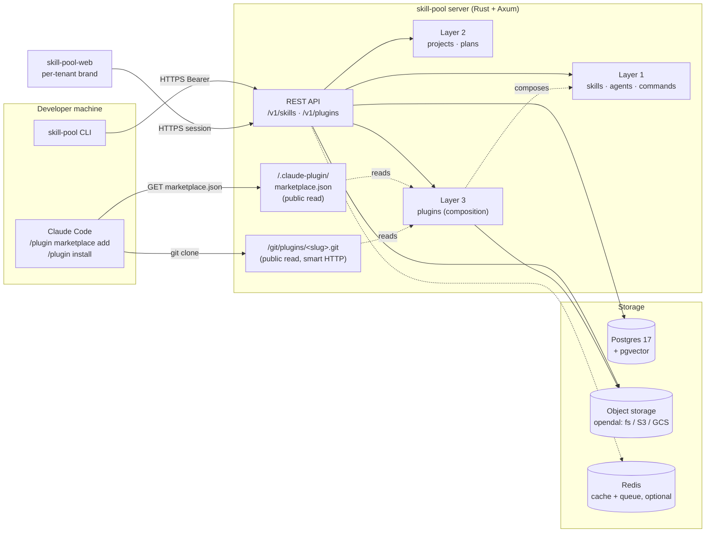

# Architecture

> Phase 1 baseline. Updated as implementation progresses.

## Components



The three served surfaces — REST API, `/.claude-plugin/marketplace.json`, and
`/git/plugins/<slug>.git` — sit on the same Axum router. Plugins are a
**composition layer** above skills, agents, and commands: a published plugin
row pins existing catalogue entries by `(slug, kind, version)`. The
marketplace endpoint and the per-plugin git endpoint are the only public
read surfaces Claude Code's installer consumes. See
[`docs/plugins.md`](plugins.md) and
[`docs/api.md`](api.md#plugins-layer-3) for the per-route detail.

## Process boundaries

- **CLI** runs on every developer machine; symlinks skills into `~/.claude/skills/` or `<project>/.claude/skills/`.
- **Server** is stateless. All shared state lives in Postgres, object storage, and (Phase 2+) Redis.
- **Capturer daemon** (Phase 4) runs per-user as a systemd unit; talks to the server like the CLI does.

## Tenancy

- **Shared mode (default):** one server / DB / bucket; every row carries `tenant_id`; subdomain routing.
- **Dedicated mode (Enterprise opt-in):** one server / DB / bucket per tenant; same image, different DSN.

See `docs/tenancy.md`.

## Data flow — publish

```
CLI: skill-pool publish ./my-skill/
  → tar+gzip the directory                  (client)
  → POST /v1/skills (multipart)             (HTTPS)
    → tenant + auth extraction              (server)
    → bundle.tar.gz lint + secret scan      (server)
    → SHA-256 + upload to object storage    (server → opendal)
    → INSERT INTO skills (...)              (server → Postgres)
    → INSERT INTO audit_events (...)        (server → Postgres)
  ← 201 Created with canonical metadata     (server → CLI)
```

## Data flow — install

```
CLI: skill-pool ensure
  → load .skill-pool/manifest.toml
  → for each skill not yet in ~/.skill-pool/library/<tenant>/<slug>@<ver>/:
      GET /v1/skills/{slug}/bundle.tar.gz   (HTTPS; redirect to signed URL on S3)
      extract to library
  → symlink library entry into .claude/skills/
```

## Key invariants

1. Every business query filters by `tenant_id`. Code review + tests enforce.
2. Object storage keys are tenant-prefixed (`{tenant_id}/...`). Bundle URIs in DB are opaque to the client.
3. Audit log writes are non-optional. Every mutating endpoint writes.
4. App is stateless; safe to replicate horizontally.
