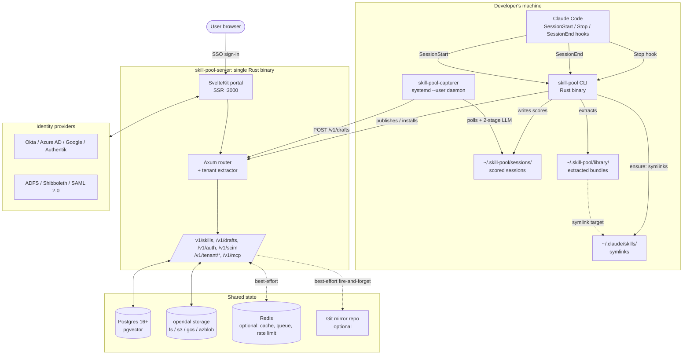
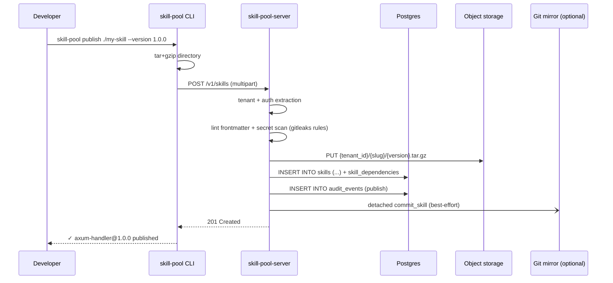
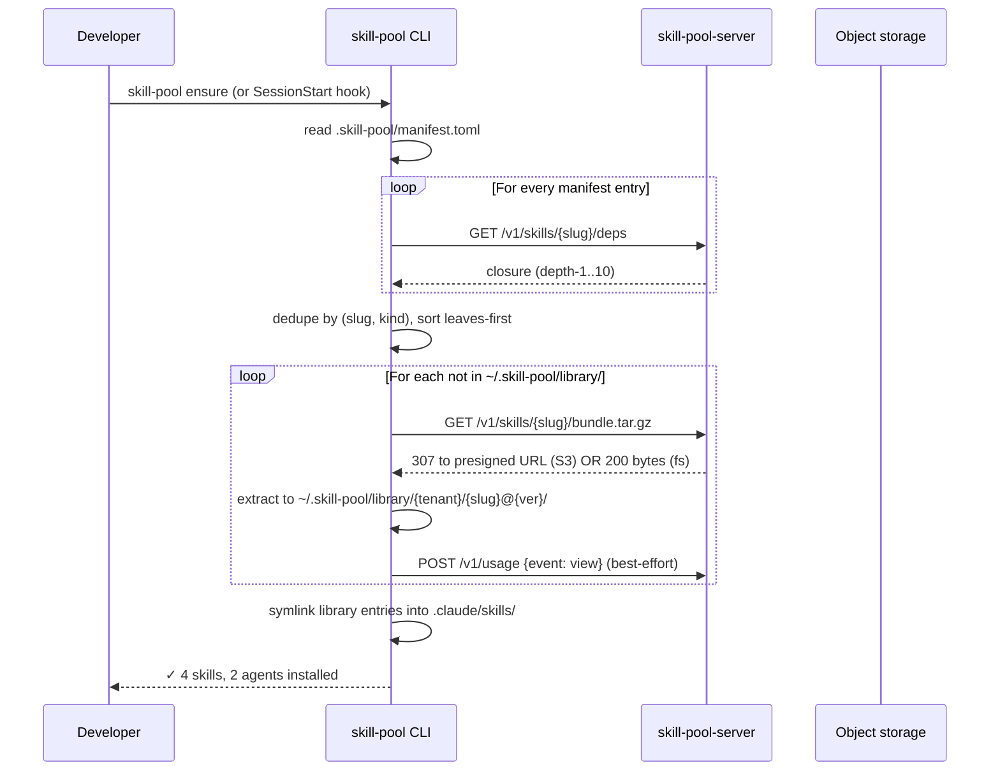

# Architecture

> The 10,000-ft view of how the four processes (CLI, server, web, capturer
> daemon) fit together, where state lives, and which invariants every
> change has to preserve.

## Component diagram



The diagram above includes the optional pieces (Redis, git mirror,
capturer daemon). The minimum viable deployment is server + Postgres +
local filesystem storage; everything else degrades gracefully when
absent.

## Process boundaries

- **CLI** (`cli/`) — Rust binary, runs on every developer machine.
  Symlinks skills into `~/.claude/skills/` (user scope) or
  `<project>/.claude/skills/` (project scope). See [CLI Reference](CLI-Reference.md).
- **Server** (`server/`) — Axum HTTP server, **stateless**. All shared
  state lives in Postgres, object storage, and (optionally) Redis. Safe
  to replicate horizontally — there is no in-process cache that breaks
  on multi-replica deploys.
- **Web** (`web/`) — SvelteKit portal in adapter-node mode, SSR on
  `:3000`. Talks to the server over HTTP for everything; tenant
  resolution happens once per request in `web/src/hooks.server.ts`.
- **Capturer daemon** (`cli/src/bin/skill-pool-capturer.rs`) — per-user
  systemd unit. Talks to the server like the CLI does. Optional Mode A
  (hourly timer) or Mode B (long-lived daemon) — see
  [Phase-4-Capture](Phase-4-Capture.md).

## Tenancy

- **Shared mode (default).** One server / DB / bucket; every row carries
  `tenant_id`; subdomain routing on the `Host` header (`acme.skill-pool.example.com`).
- **Dedicated mode (Enterprise opt-in).** Same Docker image, different
  DSN. Operator sets `SKILL_POOL_TENANCY_MODE__MODE=dedicated` plus
  `__TENANT_SLUG=acme` — the extractor returns the pinned slug regardless
  of `Host`. Useful for data-residency without forking.

Full detail in [Multi-Tenancy](Multi-Tenancy.md). The static-analysis
harness that enforces tenant filtering lives at
`server/tests/tenant_scoping.rs`.

## Data flow — publish



Reference: `server/src/routes/skills.rs::post_skill`.

## Data flow — install (`skill-pool ensure`)



Reference: `cli/src/cmd/ensure.rs`. The dedup/sort logic lives there;
the closure walk hits the server endpoint described in
[API Reference](API-Reference.md#dependency-closure).

## Data flow — retrospective capture (Phase 4)

```mermaid
sequenceDiagram
    participant CC as Claude Code
    participant Stop as Stop hook<br/>(capture-score)
    participant End as SessionEnd hook<br/>(capture-queue)
    participant Daemon as skill-pool-capturer
    participant Anth as Anthropic Messages API
    participant Srv as skill-pool-server

    CC->>Stop: per-turn payload
    Stop->>Stop: deterministic rules (~50ms)
    Stop->>Stop: ~/.skill-pool/sessions/<id>.json
    CC->>End: SessionEnd payload
    End->>End: read score, gate on threshold (default 50)
    End->>End: ~/.skill-pool/queue/<id>.queued
    Daemon->>Daemon: poll every 30s
    Daemon->>Anth: Stage 1 — Haiku — extract structured JSON
    alt generalizable == false
        Daemon->>Daemon: persist state.stage1_rejected, stop
    else
        Daemon->>Anth: Stage 2 — Sonnet — generate SKILL.md
        Daemon->>Daemon: client-side secret scan
        Daemon->>Srv: POST /v1/drafts (multipart)
        Daemon->>Daemon: persist state.drafted + desktop toast
    end
```

Full pipeline detail in [Phase-4-Capture](Phase-4-Capture.md).

## Storage layout

Object storage (any opendal backend — `fs://`, `s3://`, `gcs://`, `azblob://`):

```
{tenant_id}/{slug}/{version}.tar.gz         ← published skills
{tenant_id}/drafts/{draft_uuid}.tar.gz      ← Phase 4 drafts (pre-publish)
{tenant_id}/theme/logo.{svg,png,jpg,webp}   ← tenant logo
{tenant_id}/theme/favicon.{ico,svg,png,…}   ← tenant favicon
```

The tenant-id prefix means a stolen pre-signed URL can never enumerate
another tenant's bundles — keys must be known.

## Key invariants

1. **Tenant filtering.** Every SQL query that reads or writes a
   business table filters by `tenant_id` from the extractor.
   Enforced by code review + the static-analysis harness in
   `server/tests/tenant_scoping.rs` (see #8 §L17).
2. **Tenant-prefixed object keys.** No flat namespace anywhere.
3. **Mandatory audit log.** Every mutating endpoint writes to
   `audit_events`. The schema is in `server/migrations/0004_audit.sql`
   and the helper in `server/src/audit.rs`.
4. **No auto-migrate on startup.** The server binary does not run
   `sqlx migrate` on boot — migrations are a separate operator step so
   a broken deploy can never run a migration as a side effect. See
   `docs/ops/rollback.md`.
5. **App is stateless.** Safe to replicate horizontally. The only
   process-local state is the custom-domain cache (refreshed every
   60s) and the optional embedder model file.

## Background tasks

The server boots a handful of long-lived `tokio::spawn` tasks. All
share the same shutdown channel — SIGTERM drains them in parallel.

| Task                                       | Source                          | Cadence       |
|--------------------------------------------|---------------------------------|----------------|
| Decay sweep (`archive_candidate` flagger)  | `routes::decay`                  | every 24h      |
| Custom-domain cache refresh                | `state::refresh_custom_domains`  | every 60s      |
| Webhook delivery worker                    | `notifications::deliver`         | on demand      |
| Email DLQ retry                            | `email_branding::dlq_worker`     | every 30s      |
| Redis queue worker                         | `queue::run_worker`              | continuous     |

## Where to read next

- [API Reference](API-Reference.md) — every endpoint and its tenant scope
- [Multi-Tenancy](Multi-Tenancy.md) — tenant resolution algorithm in full
- [Operator Guide](Operator-Guide.md) — pick a deploy path
- [Phase-4-Capture](Phase-4-Capture.md) — the LLM capturer pipeline
- [Phase-5-Lifecycle](Phase-5-Lifecycle.md) — decay, deps, agents, MCP

## Cross-links into the codebase

- `cli/src/main.rs` — every subcommand
- `server/src/main.rs` — boot sequence + background tasks
- `server/src/routes/mod.rs` — route table
- `server/src/tenant.rs::TenantCtx::from_request_parts` — tenant resolution
- `server/src/audit.rs` — append-only audit log helper
- `web/src/hooks.server.ts` — theme + tenant resolution on the SSR side
- `docs/architecture.md` — the original architecture note this page mirrors
