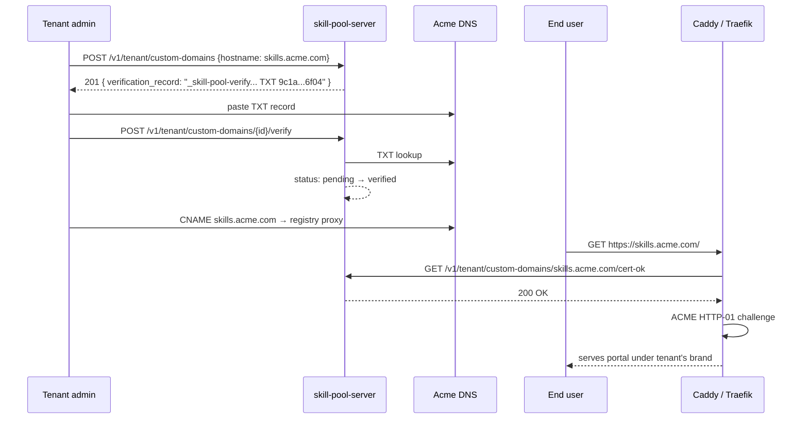

# Custom Domain + ACME

> Per-tenant hostnames terminating on the same backend. An Enterprise
> tenant points `skills.acme.com` at the registry, the server records
> the mapping plus its verification status, and the reverse proxy
> issues on-demand certificates only for hostnames the server says
> are verified.


## The story



1. Acme's tenant admin signs in and POSTs to
   `/v1/tenant/custom-domains` with `{"hostname": "skills.acme.com"}`.
   They get back a `verification_record` line:

   ```
   _skill-pool-verify.skills.acme.com TXT 9c1a…6f04
   ```

2. The admin pastes that into their DNS provider's panel.

3. They wait for propagation, then POST
   `/v1/tenant/custom-domains/{id}/verify`. The server runs a TXT
   lookup against `_skill-pool-verify.skills.acme.com`, finds the
   token, flips the row from `pending` to `verified`, and records
   `activated_at = now()`.

4. The admin updates their public DNS so `skills.acme.com` is a
   CNAME (or A record) pointing at the registry's reverse proxy.

5. The first end-user request to `https://skills.acme.com/`
   triggers the reverse proxy's on-demand TLS hook. The proxy calls
   `GET /v1/tenant/custom-domains/skills.acme.com/cert-ok` — a
   no-auth endpoint that returns 200 because the hostname is in
   `verified`/`active` status. Caddy/Traefik then issues a Let's
   Encrypt cert via HTTP-01 (or TLS-ALPN-01) and starts serving.

6. The operator optionally runs
   `skill-pool-server admin custom-domain --tenant acme activate
   --id <ID>` to flip status from `verified` to `active`. Bookkeeping
   only — routing already works once `verified`.

## Database schema

Migration `0022_tenant_custom_domains.sql`:

```sql
CREATE TABLE tenant_custom_domains (
    id, tenant_id, hostname (UNIQUE), status,
    verification_token, last_checked_at, last_error,
    created_at, activated_at
);
```

State machine:

```text
pending  ─[ DNS TXT confirmed ]──>  verified  ─[ operator activate ]──>  active
   │                                    │
   └────── failed (DNS lookup error, token mismatch) <─────┘
```

`pending` and `failed` are NOT in the request-routing cache.
`verified` and `active` are. Practically the distinction is
operational: `verified` means the tenant proved DNS control; `active`
means the operator has confirmed the reverse proxy is wired up. Same
routing behaviour for either.

## API reference

All endpoints (except `cert-ok`) require `tenant:admin` scope.

| Method | Path                                            | Description                                  |
|--------|-------------------------------------------------|----------------------------------------------|
| POST   | `/v1/tenant/custom-domains`                     | Claim a hostname; returns TXT verification record |
| GET    | `/v1/tenant/custom-domains`                     | List this tenant's domains with status        |
| POST   | `/v1/tenant/custom-domains/{id}/verify`         | Run DNS TXT lookup; flip status               |
| DELETE | `/v1/tenant/custom-domains/{id}`                | Withdraw a claim                              |
| GET    | `/v1/tenant/custom-domains/{host}/cert-ok`      | **No auth.** 200 if verified/active           |

`cert-ok` is the integration point with the reverse proxy. It is
deliberately unauthenticated because the proxy calls it before TLS is
even negotiated — the only thing the proxy knows is the SNI hostname
the client requested. Returning 404 makes the proxy refuse to issue a
cert, defending against random-hostname cert-flood attacks.

## Admin CLI

```bash
# Claim a hostname for Acme. Prints the TXT record the tenant pastes.
skill-pool-server admin custom-domain --tenant acme add --hostname skills.acme.com

# List Acme's domains.
skill-pool-server admin custom-domain --tenant acme list

# Verify via the HTTP endpoint.
skill-pool-server admin custom-domain --tenant acme verify --id <UUID>

# Operator override: flip straight to `active`, skipping DNS. Use for
# private CAs, air-gapped deploys, or when the operator has already
# provisioned a cert out-of-band.
skill-pool-server admin custom-domain --tenant acme activate --id <UUID>

# Withdraw the claim.
skill-pool-server admin custom-domain --tenant acme remove --id <UUID>
```

## Reverse proxy setup

### Caddy (on-demand TLS) — recommended

Pair this with the wildcard config in `packaging/proxy/Caddyfile`. The
`on_demand_tls.ask` URL points at the registry's `cert-ok` endpoint —
Caddy will only attempt ACME issuance for hostnames the server has
already approved.

```caddyfile
{
    on_demand_tls {
        ask http://127.0.0.1:8080/v1/tenant/custom-domains/{http.request.host}/cert-ok
    }
}

# Catch-all for non-wildcard hostnames. The TLS block tells Caddy to
# resolve the cert on-demand instead of pre-fetching at start-up.
:443 {
    tls {
        on_demand
    }

    @api path /v1/* /metrics
    reverse_proxy @api 127.0.0.1:8080

    reverse_proxy 127.0.0.1:3000 {
        header_up Host {host}
        header_up X-Real-IP {remote_host}
        header_up X-Forwarded-For {remote_host}
        header_up X-Forwarded-Proto {scheme}
    }
}
```

The existing `*.skill-pool.example.com` block keeps its wildcard cert
behaviour — Caddy only falls into the `:443` catch-all when the SNI
doesn't match the wildcard.

### Traefik (per-host HTTP-01)

The router rule in `packaging/proxy/traefik.yml` handles "any host
that isn't `*.skill-pool.example.com`". To gate ACME issuance on the
registry's allow-list, point Traefik at a forwardAuth middleware:

```yaml
http:
  middlewares:
    custom-domain-allow:
      forwardAuth:
        address: "http://127.0.0.1:8080/v1/tenant/custom-domains/{Host}/cert-ok"
        trustForwardHeader: true

  routers:
    skill-pool-custom-domain:
      rule: "!HostRegexp(`{any:.*}.skill-pool.example.com`) && !Host(`skill-pool.example.com`)"
      entryPoints: [websecure]
      service: skill-pool-web
      middlewares: [custom-domain-allow]
      tls:
        certResolver: letsencrypt
      priority: 1
```

Traefik doesn't have a Caddy-style `on_demand_tls.ask` hook, but
forwardAuth approximates it: requests for unverified hosts are 404'd
before they reach the registry, and Traefik's cert issuance is gated
by the same response.

### Nginx + certbot (operator-driven)

For deploys that already use nginx + certbot, per-host certificate
issuance is operator-managed:

```bash
# 1. Confirm cert-ok returns 200.
curl -i http://127.0.0.1:8080/v1/tenant/custom-domains/skills.acme.com/cert-ok

# 2. Run certbot.
certbot certonly --webroot -w /var/www/html -d skills.acme.com

# 3. Add a server block:
#   server {
#     server_name skills.acme.com;
#     listen 443 ssl;
#     ssl_certificate     /etc/letsencrypt/live/skills.acme.com/fullchain.pem;
#     ssl_certificate_key /etc/letsencrypt/live/skills.acme.com/privkey.pem;
#     location /v1/   { proxy_pass http://127.0.0.1:8080; }
#     location /metrics { proxy_pass http://127.0.0.1:8080; }
#     location /      { proxy_pass http://127.0.0.1:3000; }
#   }
```

No automatic on-demand path here — certbot is request-driven by the
operator. Fine for low-churn deploys.

## Tenant resolution

`server/src/tenant.rs::TenantCtx::from_request_parts` checks the
custom-domain cache **before** the existing subdomain/header logic.
The cache is loaded at startup and refreshed every 60s by a
background task in `AppState::spawn_custom_domain_refresher`. The
verify, delete, and admin CLI paths force an immediate refresh so
admins see flips without waiting out the TTL.

Cache miss falls through to the existing logic. That means
`X-Skill-Pool-Tenant: acme` and `acme.skill-pool.example.com` keep
working exactly as before; custom domains are an additive code path.

## Caveats

- **Verification is one-shot.** Once a row flips to `verified`, the
  server never re-checks the TXT record. If the tenant rotates the
  zone or accidentally deletes the TXT, the mapping stays active. To
  re-verify, delete the row and re-add it. Same model as Let's
  Encrypt's account-side verification — proof of control at a point
  in time, not continuous.

- **Rate-limit verification.** Each call to `verify` runs an upstream
  DNS lookup. Production deploys should put the route behind
  tenant-scoped rate limits (already wired — see `server/src/rate_limit.rs`)
  to prevent a malicious admin from flooding their resolver.

- **`activated_at` is set on first verify**, not on first user
  request. This matches the schema's documented behaviour
  (`COALESCE(activated_at, now())` on the verified-transition update).

- **One hostname, one tenant.** The unique index on `hostname`
  enforces this. Removing a tenant's claim (DELETE) is required
  before another tenant can register the same name. No transfer
  command on purpose — explicit ownership change forces an admin to
  think.

- **No wildcard custom domains.** This flow is for exact hostnames
  only. Wildcard tenant subdomains (`*.skill-pool.example.com`) stay
  on the wildcard cert path. If a tenant wants `*.skills.acme.com`,
  they need a DNS challenge on the upstream proxy — out of scope.

- **The cache is per-process.** A multi-replica deploy has each
  replica's cache refreshing independently every 60s. Mutating
  endpoints refresh inline on the replica handling the request —
  peer replicas catch up on the next tick. This is fine because the
  cache is purely a positive filter: a missing entry falls through
  to subdomain resolution (or 401).

## Where to read next

- [Multi-Tenancy](Multi-Tenancy.md) — tenant resolution algorithm
- [Operator Guide](Operator-Guide.md) — wildcard DNS setup (Caddy/Traefik)
- [Theming](Theming.md) — `resolveTenant` reads the slug from the custom
  domain's leftmost label, so the right tenant theme is served the
  moment the custom domain is verified

## Cross-links into the codebase

- `server/migrations/0022_tenant_custom_domains.sql` — schema
- `server/src/routes/custom_domains.rs` — endpoints
- `server/src/admin.rs` — CLI helpers (add/list/verify/activate/remove)
- `server/src/tenant.rs::from_request_parts` — cache-first resolution
- `server/src/state.rs::refresh_custom_domains` — cache lifecycle
- `server/tests/custom_domains.rs` — end-to-end test
- `packaging/proxy/Caddyfile` — reverse-proxy wildcard template
- `packaging/proxy/traefik.yml` — Traefik dynamic config
- `docs/enterprise/custom-domains.md` — original note this page mirrors
