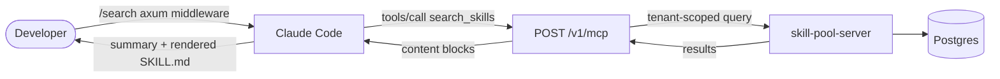

# MCP Integration

> Use skill-pool's catalog from inside a Claude Code conversation
> without leaving the chat. The server exposes a JSON-RPC 2.0 adapter
> at `POST /v1/mcp` that Claude Code can call as an MCP server.

## What it gives you



Four tools wired today:

| Tool | Args | Returns |
|---|---|---|
| `search_skills` | `{ query?, tags?, semantic?, limit? }` | Human-readable summary + fenced JSON dump |
| `get_skill` | `{ slug }` | Rendered SKILL.md (frontmatter + body) as text |
| `install_skill` | `{ slug, kind? }` | Bundle download + install confirmation |
| `get_project_plan` | `{ project_slug }` | Active plan markdown + version metadata |

`search_skills` mirrors `GET /v1/skills` semantics (semantic takes
precedence over keyword; tags compose with either). `get_skill`
returns the same SKILL.md as `GET /v1/skills/{slug}/skill-md`.
`install_skill` walks the dep closure and downloads the bundle,
just like `skill-pool ensure`. `get_project_plan` fetches the
active plan for a project without requiring `skill-pool ensure`
to have run or `.claude/PROJECT_PLAN.md` to be present on disk.

## One-time setup

Install the MCP server in Claude Code:

```bash
claude mcp add --transport http skill-pool \
  --header "Authorization: Bearer spk_…" \
  --header "X-Skill-Pool-Tenant: acme" \
  https://acme.skill-pool.example.com/v1/mcp
```

Or edit `~/.claude/settings.json` directly:

```json
{
  "mcpServers": {
    "skill-pool": {
      "type": "http",
      "url": "https://acme.skill-pool.example.com/v1/mcp",
      "headers": {
        "Authorization": "Bearer spk_…",
        "X-Skill-Pool-Tenant": "acme"
      }
    }
  }
}
```

The bearer token is the same `spk_…` your CLI uses (mint via the
profile page or `skill-pool-server admin token-create`).
`tenant:admin` scope is **not** required; `skills:read` is enough for
`search_skills`, `get_skill`, and `get_project_plan`; `skills:publish`
lets `install_skill` emit the usage event.

Verify:

```bash
claude mcp list
# skill-pool  http  (4 tools)
```

## Usage from inside a Claude session

The MCP server registers itself as a search tool. Claude calls it
when the conversation looks like a catalog query:

> **You:** Got any team skills for axum tenant extractors?
>
> **Claude:** [calls `search_skills({ query: "axum tenant", limit: 5 })`]
>
> Found 3 matches:
> - `axum-tenant-handler` — Pattern for tenant-scoped extractors
> - `tenant-ctx` — TenantCtx + AppState binding
> - `axum-handler-tip` — Borrow-checker workaround
>
> Want me to install one?

> **You:** install axum-tenant-handler
>
> **Claude:** [calls `install_skill({ slug: "axum-tenant-handler" })`]
>
> Installed `axum-tenant-handler@1.2.3` plus 2 transitive deps. Run
> `skill-pool doctor` if anything looks wrong.

> **You:** What's the current plan for acme-billing-service?
>
> **Claude:** [calls `get_project_plan({ project_slug: "acme-billing-service" })`]
>
> The active plan for `acme-billing-service` (v3, imported 2026-05-18) is:
> [uses the returned plan markdown to answer in detail]

## JSON-RPC surface

Methods:

| Method | Purpose |
|---|---|
| `initialize` | Returns `{ protocolVersion, capabilities: { tools: {} }, serverInfo }` |
| `tools/list` | Returns the four tools above |
| `tools/call` | Dispatches `{ name, arguments }` |
| `ping` | Acks health |
| `notifications/*` | Acked silently |

Errors:

| Code | Meaning |
|---|---|
| `-32601` | Method not found |
| `-32602` | Invalid params |
| `-32603` | Internal error |

`401 Unauthorized` is returned at the HTTP layer when the bearer
token is missing or invalid. A missing slug on `get_skill` /
`install_skill` returns `isError: true` with the message in the
result — **not** a JSON-RPC error — so the model can recover
gracefully.

## Tenancy

The MCP adapter is fully tenant-scoped:

- Tenant resolution uses the same extractor as the REST surface
  (`X-Skill-Pool-Tenant` header).
- Tokens are tenant-bound — a token for `acme` can never see
  `globex`'s catalog, even with the wrong header.
- The semantic similarity scope is single-tenant — embeddings never
  cross tenant boundaries.

## Where to read next

- [API Reference](API-Reference.md#mcp-phase-5) — full endpoint shape
- [Phase 5 — Lifecycle](Phase-5-Lifecycle.md#mcp-install_skill-tool) — how
  `install_skill` interacts with the dep closure walker

## Cross-links into the codebase

- `server/src/routes/mcp.rs` — JSON-RPC adapter + tool dispatch
- `server/src/routes/skills.rs::search_for_mcp` — semantic + keyword
  search adapter for `search_skills`
- `server/tests/mcp.rs` — protocol smoke tests
- `docs/api.md` — `/v1/mcp` reference
