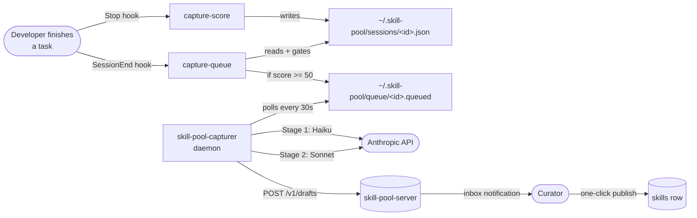
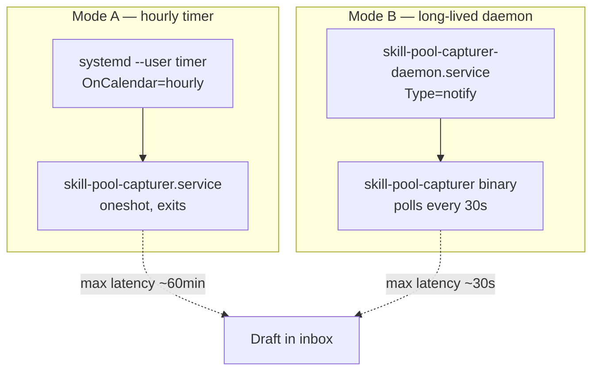

# Phase 4 — Retrospective Capture

> When a developer solves a non-trivial bug or learns a new pattern,
> the hard-won insight should land in the team's skill catalog
> without anyone stopping to fill out a publish form. Phase 4 is the
> path from "I figured it out" to "draft in the curator inbox".

Three layers ship today:

1. **Explicit `skill-pool capture`** — the developer points the CLI at
   a directory; it lands as a draft.
2. **Phase 4.5 scorer** — deterministic per-turn hook that rates the
   session in <50ms.
3. **Phase 4.6 capturer pipeline** — a two-stage LLM (Haiku → Sonnet)
   that turns draft-worthy sessions into SKILL.md drafts automatically.

## The story end-to-end



The explicit path (`skill-pool capture`) bypasses the scorer/queue
and lands the draft directly — same `POST /v1/drafts` endpoint.

---

## Layer 1 — Explicit `skill-pool capture`

The first slice. In a project where you've just solved something:

```bash
mkdir lesson-axum-handler
cat > lesson-axum-handler/SKILL.md <<'MD'
---
name: axum-handler-tip
description: Pattern for tenant-scoped axum extractors that avoids the
  borrow-checker dance with a request-scoped clone.
when_to_use: When building Axum handlers that need TenantCtx + AppState.
tags: [rust, axum, tenant]
---

# axum-handler-tip

The pattern is …
MD

skill-pool capture ./lesson-axum-handler \
  --notes "Found while fixing the SCIM list endpoint — PR #42"
```

What lands in the curator inbox:

- The bundle (server validates frontmatter + scans for secrets first).
- Status `pending`, origin `cli`.
- Tags merged from frontmatter + `--tags` flag.
- Free-form `--notes` for "why this matters" context.

Drafts are **tenant-scoped** — only the tenant you authenticated
against sees them.

### Reviewing in the web UI

Navigate to `/drafts` in the portal. The inbox shows pending drafts:

- One-click **Publish** — assigns a version (the curator types it),
  promotes to `skills`, the bundle moves to the canonical key.
- One-click **Discard** — marks the draft `discarded` (kept for
  telemetry, hidden from the default view).
- Filter tabs for `Pending` / `Published` / `Discarded` / `All`.

Publishing in one transaction: copies bundle to canonical key, INSERTs
into `skills` (rolls back on `(tenant, slug, version)` collision),
UPDATEs the draft row. Re-publishing the same draft 400s. Reusing
`(slug, version)` 400s with a "pick a different version" message.

### API contract

```text
POST   /v1/drafts                  multipart: metadata JSON + bundle .tar.gz
                                   → 201 { id, slug, status, ... }

GET    /v1/drafts?status=pending   → [Draft, …]
       (also: published, discarded, all)

GET    /v1/drafts/{id}             → Draft
GET    /v1/drafts/{id}/skill-md    → text/plain SKILL.md from bundle

POST   /v1/drafts/{id}/publish     { version: "1.0.0", slug?: "override" }
                                   → { draft_id, skill_id, slug, version }

POST   /v1/drafts/{id}/discard     → 204 No Content
```

All endpoints require `skills:read` (GET) or `skills:publish` (POST).
Drafts are tenant-isolated via the standard `TenantCtx` extractor.

### Storage layout

Drafts live under a separate object-storage prefix:

```
{tenant_id}/drafts/{draft_uuid}.tar.gz      ← while pending
{tenant_id}/{slug}/{version}.tar.gz          ← after publish
```

A discarded draft is a single DB UPDATE + a single object purge.
Publishing copies the bytes into the canonical key — no version
collisions with active publishes.

---

## Layer 2 — Phase 4.5 deterministic scorer

The scorer is a `Stop`-hook that fires after every assistant turn,
reads the session transcript, and persists a deterministic score to
`~/.skill-pool/sessions/<session_id>.json`. **No LLM. No network. No
mid-session prompts.** Designed to run in well under 50ms.

### Install

```bash
skill-pool hook-install --with-scorer
```

This installs three hooks (preserving every other hook in
`.claude/settings.json` — install and remove operate on a JSON merge):

- `SessionStart` → `skill-pool ensure --quiet` (Phase 3)
- `Stop`         → `skill-pool capture-score`  (Phase 4.5, per-turn)
- `SessionEnd`   → `skill-pool capture-queue`  (Phase 4, once at end)

`--remove` pulls all three.

### Signals scored today

| Rule | Weight | Threshold |
|------|-------:|-----------|
| Explicit marker | 1000 | user said "remember this" / "TIL" / `/capture-skill` |
| Test recovery | 50 | same `cargo test`/`pytest`/`npm test` failed ≥2× then passed |
| Edit retries | 30 | >3 failed `Edit`/`Write` on the same `file_path` |
| Cross-session recurrence | 30 | same fingerprint seen in 3+ distinct local sessions |
| Novel command | 15 | failed Bash stem not in shell history (capped at 3) |
| Long session | 5 | >20 assistant turns |

Cross-session recurrence: the index at
`~/.skill-pool/recurrence_index.json` maps fingerprint →
`[session_ids]`. Each `capture-score` invocation appends the current
session before consulting the count, so the same session never
inflates its own recurrence score.

Default draft-worthy threshold: **score ≥ 100**. The capturer daemon
(Phase 4.6) picks from `sessions/` files at or above this; for now
the threshold drives the ★ marker in `capture-status`.

### Inspect

```bash
skill-pool capture-status
# 12 sessions scored (3 ≥ draft threshold of 100)
#
#   SCORE  TURNS  CWD                SESSION
#  ★1050   3      /proj/foo          signals-1
#         ↳ explicit_marker: user said `remember this`
#  ★ 130  18      /proj/bar          a4b2c1d…
#         ↳ test_recovery: `cargo test` failed 3× then passed
#     5   26      /proj/baz          f8e9d2c…
#         ↳ long_session: 26 assistant turns in this session
```

### SessionEnd queueing

Where Stop re-scores every turn, the SessionEnd hook fires exactly
once when a session terminates. It reads the score the Stop hook
wrote and, if the total is at or above the configured threshold,
drops a small marker:

```text
~/.skill-pool/queue/<session_id>.queued
  { "queued_at": …, "session_id": …, "score": …, "threshold": … }
```

Threshold precedence:

1. `--threshold N` flag on the hook command
2. `SKILL_POOL_CAPTURE_THRESHOLD` env var
3. Default: **50** (deliberately lower than the per-turn draft
   threshold of 100; SessionEnd fires only once, so we surface more
   sessions to the LLM gate downstream).

A non-numeric env value falls back to the default with a `tracing`
warning rather than failing the hook — same fail-soft policy as
`capture-score`.

---

## Layer 3 — Phase 4.6 capturer pipeline

The capturer is the LLM layer above the scorer. It turns "this
session was worth saving" into "a draft is in the inbox" without
anyone typing `skill-pool capture` by hand. Two-stage so that ~70%
of sessions cost only the cheap extractor pass.

### Run manually

```bash
skill-pool capture-run                # process up to 5 sessions
skill-pool capture-run --limit 20     # cost cap per pass
skill-pool capture-run --dry-run      # show what would happen
skill-pool capture-run --stage1-model claude-haiku-4-5-20251001 \
                       --stage2-model claude-sonnet-4-6
```

### Pipeline

```text
for each session in ~/.skill-pool/sessions/ where
      score >= 100 AND capture_state is None:
  1. read transcript from ~/.claude/projects/.../session.jsonl
  2. Stage 1 — Haiku — returns JSON:
       { problem, solution_steps, generalizable, scope, preconditions }
  3. if generalizable == false → state.stage = Stage1Rejected, STOP
  4. Stage 2 — Sonnet — returns SKILL.md
  5. client-side validate (frontmatter, secret scan, /home/ paths)
  6. tar.gz + POST /v1/drafts with origin=capture-scorer
  7. persist updated capture_state
```

State transitions land in the score record so the next pass skips
already-processed sessions:

| `capture_state.stage`   | What it means                                          |
|-------------------------|--------------------------------------------------------|
| `stage1_rejected`       | Stage 1 said `generalizable: false`. No draft.         |
| `stage1_parse_failure`  | Stage 1 JSON didn't parse. Future run may retry.       |
| `stage2_rejected`       | Stage 2's SKILL.md failed client-side validation.      |
| `drafted`               | Successfully POSTed. Inbox now has it.                  |
| `server_rejected`       | Server returned non-2xx (e.g. dedupe / network).        |

### Scheduling — Mode A vs Mode B



**Mode A** (default, low idle cost):

```bash
cp packaging/systemd/skill-pool-capturer.{service,timer} ~/.config/systemd/user/
systemctl --user daemon-reload
systemctl --user enable --now skill-pool-capturer.timer
```

The timer fires `skill-pool capture-run --limit 5` every hour with up
to 10 min jitter. Latency from "session ended" to "draft on the
server" is bounded by the timer cadence.

**Mode B** (lower latency, persistent process):

```bash
cp packaging/systemd/skill-pool-capturer-daemon.service ~/.config/systemd/user/
systemctl --user daemon-reload
# Disable Mode A if it was previously enabled — the two are mutually exclusive.
systemctl --user disable --now skill-pool-capturer.timer
systemctl --user enable --now skill-pool-capturer-daemon.service
```

The daemon polls `~/.skill-pool/queue` and `~/.skill-pool/sessions`
every 30 seconds (`SKILL_POOL_CAPTURER_POLL_SECS` to override). Same
Haiku → Sonnet → POST pipeline; it just notices new work within a
poll cycle instead of an hour. Graceful shutdown on SIGINT/SIGTERM.

The Nix module exposes the same toggle declaratively:

```nix
services.skill-pool-capturer = {
  enable = true;
  daemon = true;                                # opt into Mode B
  pollSecs = 30;
  environmentFile = config.age.secrets.skill-pool-anthropic.path;
};
```

### Required environment

- `ANTHROPIC_API_KEY` — for the Messages API. The capturer fails fast
  and tells you to set it.
- `SKILL_POOL_REGISTRY` (or a config file from `skill-pool login`) —
  for the draft POST.

### Cost shape

Stage 1: **Haiku**, `max_tokens=1024`, `temperature=0`. Prompt
~500 tokens of system text + a trimmed transcript capped at 12000
chars (~3000 input tokens). One pass per session is a few cents
worst-case, fractions thereof typically.

Stage 2: **Sonnet**, `max_tokens=2048`, `temperature=0.2`. Only runs
on sessions Stage 1 approved (~30% pass-through). Pays the expensive
call only on the fraction worth drafting.

### Desktop notifications

Each successful `POST /v1/drafts` fires a desktop toast:

> **Skill draft ready**
> Draft `my-skill` is waiting in the inbox.
> https://your-portal/drafts/<id>

The link target comes from the `web_url` field in
`~/.config/skill-pool/config.toml`:

```toml
web_url = "https://skills.acme.example.com"

[registry]
url    = "https://skills.acme.example.com"
tenant = "acme"
```

To silence:

- Per-invocation: `--no-notify` on `capture-run` or `skill-pool-capturer`.
- Env-wide: `SKILL_POOL_CAPTURE_NO_NOTIFY=1`.
- Declarative (Nix): `services.skill-pool-capturer.noNotify = true;`.

Notifications are best-effort: a headless host (no
`DBUS_SESSION_BUS_ADDRESS`) silently skips the toast.

### Pre-stage-2 + pre-POST secret scan

The capturer runs gitleaks rules at two points in the pipeline:

1. **Before Stage 2.** The Stage 1 JSON contains the candidate
   problem/solution; if it leaks an API key the model saw, the
   capturer drops the session before paying for Sonnet.
2. **Before POST.** The final SKILL.md gets scanned again. If
   findings exist, capture-run aborts with state =
   `stage2_rejected`.

`--allow-secret` (or the per-tenant `allow_secret_scan` flag in
config) bypasses both layers. Use only when triaging a regex
false-positive — the server runs its own scan too.

---

## Embedding dedup (Phase 5 integration)

On `POST /v1/drafts` the server (with `--features fastembed`):

1. Computes a 384-dim embedding of the description.
2. Queries existing published skills in the same tenant for cosine
   similarity, ordered by closeness, limit 1.
3. If similarity ≥ 0.85, persists `merge_proposal_skill_id` +
   `merge_proposal_similarity` on the draft row.
4. The response (and `GET /v1/drafts`) surfaces
   `merge_proposal_slug` + `merge_proposal_similarity`.

The web inbox shows a "Looks like *foo* (94% match)" badge with a
link to the proposed target skill.

Tenant isolation: dedup queries are scoped to the same tenant. A
near-duplicate in another tenant's catalog never flags.

---

## Curator notifications (Phase 5 integration)

Per-tenant webhook fires fire-and-forget on every `draft.create`.
Compatible with Slack/Discord incoming webhooks out of the box —
top-level `text` field plus structured `event`/`tenant`/`draft`
fields for custom receivers.

Configure once via the admin portal at `/admin/notifications` (or via
`PUT /v1/tenant/notifications`):

```http
PUT /v1/tenant/notifications
Authorization: Bearer <admin-token>
Content-Type: application/json

{ "webhook_url": "https://hooks.slack.com/...", "webhook_secret": "optional" }
```

With a secret, each delivery is signed with HMAC-SHA256 and the
digest shipped in `X-Skill-Pool-Signature: sha256=<hex>` — same
convention as GitHub/Stripe webhooks.

Delivery: detached `tokio::spawn` after the POST returns; 5s timeout
per attempt, one retry on transient failure (4xx are permanent).
Every attempt — success or failure — writes an audit event.

Sidebar badge: the web layout polls
`GET /v1/tenant/notifications/pending-count` on every page load and
renders a primary-colored pill next to "Drafts".

---

## Audit trail

Every mutating draft endpoint writes to `audit_events`:

- `draft.create` (with size, sha256, slug)
- `draft.publish` (with version, target skill_id)
- `draft.discard`

Append-only, retained per-tenant policy. Same export pipeline as the
rest of the audit log.

---

## What's NOT wired yet

- **Email notifications.** Webhook + Slack/Discord covers most teams.
- **NixOS module variant for the daemon — wired today**; the timer
  variant is the older path. Both produce the same `~/.skill-pool/`
  side-effects.

The signal scorer plus the two-stage drafter together give the policy
the master plan called for: precision over recall, deterministic gate
first, LLM only on the fraction that clears it, human-in-the-loop on
every published draft.

---

## Where to read next

- [CLI Reference](CLI-Reference.md) — `capture`, `capture-score`,
  `capture-queue`, `capture-run`, `capture-status`
- [Phase 5 — Lifecycle](Phase-5-Lifecycle.md) — what happens to drafts
  after publish
- [API Reference](API-Reference.md#drafts-phase-4) — `/v1/drafts` endpoints

## Cross-links into the codebase

- `cli/src/scorer.rs` — Phase 4.5 deterministic scorer
- `cli/src/capturer.rs` — Phase 4.6 LLM pipeline (Haiku → Sonnet)
- `cli/src/bin/skill-pool-capturer.rs` — long-lived daemon (Mode B)
- `cli/src/cmd/capture.rs` — explicit CLI verb
- `cli/src/cmd/capture_run.rs` — Mode A timer entry point
- `server/src/routes/drafts.rs` — server-side draft routes
- `server/src/embedding.rs` — pgvector + fastembed integration
- `packaging/systemd/` — capturer unit files (timer + daemon variants)
- `docs/capture.md` — original capture note this page mirrors
